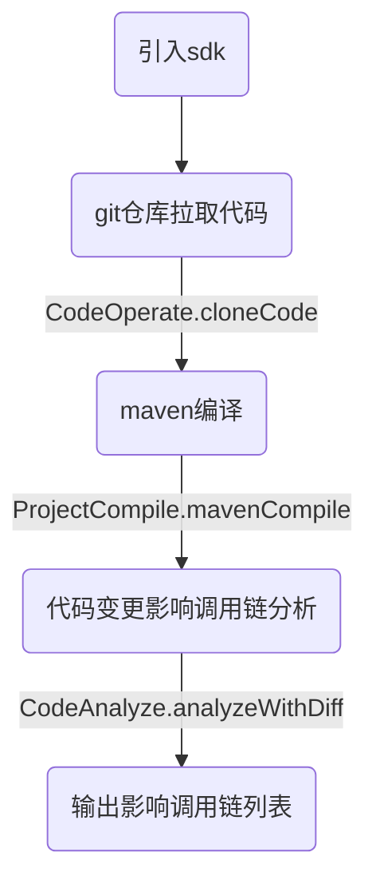
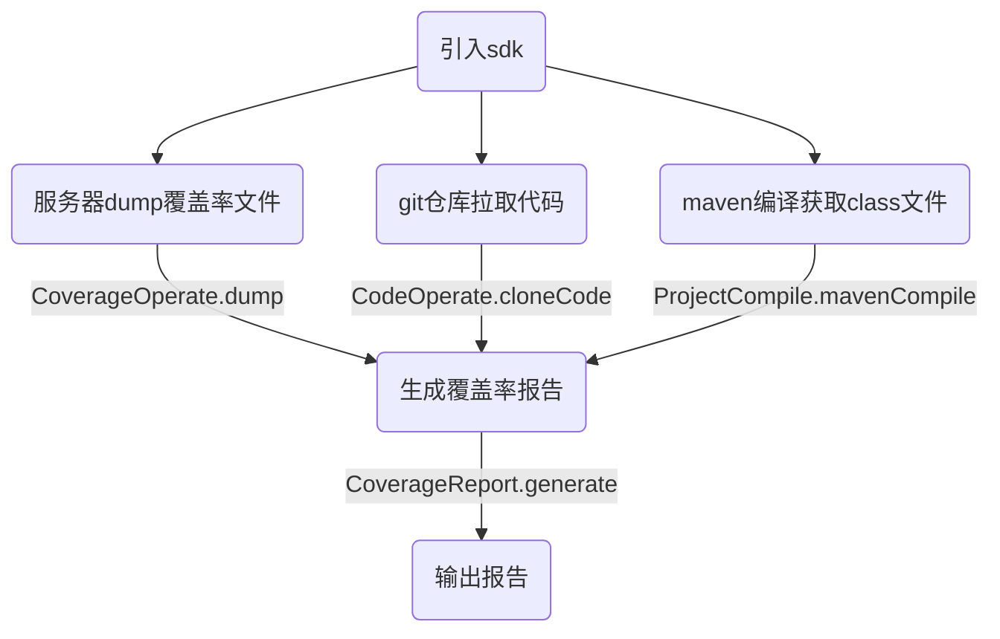

# [mebius](https://g.hz.netease.com/qa-tech/mebius)

### 一、简介

------

精准测试sdk是基于java语言开发，提供两大核心能力。

- 代码覆盖率统计
- 代码修改影响调用链分析

并在此基础上封装成一个个原子能力，自由编排，旨在以更方便简单的方式为QA团队赋能，提高研发测试效率。

### 二、SDK使用

------

- 执行SDK打包:

```plaintext
mvn clean install -Dmaven.test.skip=true
```

- 执行SDK发布:

```plaintext
mvn clean deploy -Dmaven.test.skip=true
```

- 平台侧引入：

```xml
<dependency>
    <groupId>com.netease</groupId>
    <artifactId>mebius-client</artifactId>
    <version>1.0.1-SNAPSHOT</version>
</dependency>
```

### 三、快速开始

------

analyzeWithDiff

```java
public static void main(String[] args) {
    GitParam gitParam = new GitParam();
    gitParam.setGitAccessType(ACCESS_TOKEN);
    gitParam.setGitAccessToken("demo项目git通行令牌");
    gitParam.setGitRepoDir("demo项目路径");

    List<ProjectParam> projectParams = Lists.newArrayList();
    ProjectParam projectParam = new ProjectParam();
    projectParam.setProjectRootPath("demo项目根目录");
    projectParam.setExecType(ExecType.COMMIT_DIFF);
    projectParam.setCurrentBranch("demo项目当前分支");
    projectParam.setCompareBranch("demo项目对比分支");
    projectParam.setGitParam(gitParam);
    projectParams.add(projectParam);

    try {
        List<MethodsCallResult> results = CodeAnalyze.analyzeWithDiff(projectParams, null);
    } catch (Exception e) {
        e.printStackTrace();
    }
}
```

#### 更多示例

- [mebius-test](/mebius-test)

#### 四、编排示例

------

###### 代码分析示例：



###### 覆盖率示例：



### 

### 五、工程结构

------

├── action                        // 业务访问入口（每个类代表一类核心功能）

├── constant                   // 常量

├── enums                      // 枚举

├── exception                 // 自定义异常类

├── executor                   // 核心执行处理器

├── model                       // 数据模型

├── utils                           // 工具类

### 六、功能点清单

------

- [代码静态分析](docs/codeAnalyze.md)

  - [多工程影响调用链分析](docs/analyzeWithDiff.md)
  - [多工程指定类、方法影响调用链分析](docs/analyzeWithSpecify.md)

- [代码操作](docs/codeOperate.md)

  - [代码diff比较](docs/codeDiff.md)
  - [Git代码操作](docs/gitOperate.md)

- [覆盖率操作](docs/coverageOperate.md)

- [覆盖率报告](docs/coverageReport.md)

- [工程编译](docs/projectCompile.md)

- [解析工程下mapping Url](docs/urlMappingAnalyze.md)

- 工程中Java文件依赖分析

  

### 七、开源规范

------

对应bug上报、问题咨询和讨论，可以提交issue

